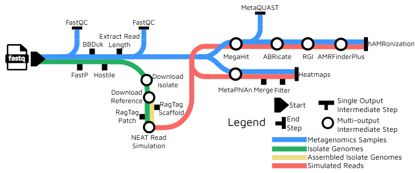

# :rocket: ASTRO: AMR Metagenomics Detection, Simulation, Taxonomic Classification, and Read Optimization

### :rocket: **Pipeline Under Development** :rocket:


## Introduction

**ASTRO: AMR Metagenomics Detection, Simulation, Taxonomic Classification, and Read Optimization** is a bioinformatics pipeline that performs taxonomic profiling, screens metagenomes and isolate genomes for determinants of antimicrobial resistance, simulates reads, and generates a bacterial metagenomic _in silico_ reference dataset.

[](https://www.nextflow.io/)
[](https://www.docker.com/)


The three primary objectives of the ASTRO workflow entail:

* Simulate sequencing reads with identified species and phyla of interest
* Perform taxonomic profiling and antimicrobial resistance gene (ARG) detection on empirical metagenomes and simulated reads
* Verify that the quality of simulated datasets mimics empirical datasets

<!-- TODO nf-core: Include a figure that guides the user through the major workflow steps. Many nf-core
     workflows use the "tube map" design for that. See https://nf-co.re/docs/contributing/design_guidelines#examples for examples.   -->
<!-- TODO nf-core: Fill in short, bullet-pointed list of the default steps in the pipeline -->

This workflow is being built with [Nextflow DSL2](https://www.nextflow.io/docs/latest/dsl2.html) and utilizes docker and singularity containers to modularize the workflow for optimal maintenance and reproducibility.

# Pipeline Summary
1.	Input paired-end metagenomic reads (.fastq) and isolate genomes (.fna)
2.	Perform preprocessing on metagenomic reads (`FastQC`, `FastP`, `BBDuk`, `Hostile`)
3.	Assemble the preprocessed reads into contigs and assess the quality of the assembled contigs (`MEGAHIT`, `QUAST`)
4.	Screen metagenomes for ARGs (`AMRFinderPlus`, `ABRICATE`, `RGI`)
5.	Perform taxonomic profiling on metagenomic reads to identify microbial community composition (`METAPHLAN`)
6.	Simulate next generation sequencing reads and spike into cleaned, empirical metagenomic dataset (`NEAT`, `RAGTAG`)
7.	Perform quality control (QC) on simulated dataset (`FastQC`)
8.	Optionally perform taxonomic profiling and ARG detection on _in silico_ dataset
9.	Generate versions and `MultiQC` reports



## Usage

> **Note**
> If you are new to Nextflow and nf-core, please refer to [this page](https://nf-co.re/docs/usage/installation) on how
> to set up Nextflow. Make sure to [test your setup](https://nf-co.re/docs/usage/introduction#how-to-run-a-pipeline)
> with `-profile test` before running the workflow on actual data. 

> To run the astro pipeline minimal test, you will need to add your user-specific credentials for the --ncbi_email, 
> --ncbi_api_key, and --metaphlan parameters to the profile script located at conf/test.config. 

> Once complete, you can run the minimal test
> with the following command:
> `nextflow run main.nf -profile test,singularity --outdir <OUTDIR>`

### Set Up:

First, input your metagenomic data into a  samplesheet so that it resembles the following:

`samplesheet.csv`:

```csv
sample,fastq_1,fastq_2
Sample1,assets/data/ERR4678562_1.fastq.gz,assets/data/ERR4678562_2.fastq.gz
Sample2,assets/data/ERR4678563_1.fastq.gz,assets/data/ERR4678563_2.fastq.gz
```

Each row represents a pair of fastq files (paired-end metagenomics reads).

You will also need to prepare a samplesheet for isolate genomes to be used in simulation: 

`isolate_samplesheet.csv`:
```csv
sample_id,added_copy_number,file_path,species_name
GCA_018454105.3,1,assets/data/GCA_018454105.3_PDT001044797.3_genomic.fna,Acinetobacter baumannii
GCA_016490125.3,1,assets/data/GCA_016490125.3_PDT000725303.3_genomic.fna,Acinetobacter baumannii
```
Each row corresponds to the following information:

- `sample_id`: Sample ID or name

- `added_copy_number`: Option to include a given number of copies of simulated genomes. If copy number variation is not desired, input '1'

- `file_path`: Path to isolate genome file (.fna)

- `species_name`: Name of isolate species

For instructions on creating an NCBI account and obtaining an API key, please visit the [National Library of Medicine Support Center](https://support.nlm.nih.gov/kbArticle/?pn=KA-05317).

### Taxonomic Classification Set Up
For ASTRO >= 1.0.0, you are required to install the MetaPhlAn 4 database. You can find guidance to do so on the [MetaPhlAn GitHub](https://github.com/biobakery/MetaPhlAn/wiki/MetaPhlAn-4) page. It is highly recommended to use the --index parameter to download a specific version of the database for use in the ASTRO pipeline. This version of ASTRO was tested using database version mpa_vJun23_CHOCOPhlAnSGB_202403.

### ASTRO Pipeline Parameters:
- `--input`: Input metagenomic samplesheet

- `--isolates`: Input isolate samplesheet

- `--ncbi_email`: User's NCBI email

- `--ncbi_api_key`: User's NCBI API key

- `--postsim`: Optionally run assembly, AMR, and taxonomic classification on simulated reads

- `--mode`: Select 'local' if providing local paths to isolate genomes; otherwise, select 'download'

- `--taxadb`: Path to MetaPhlAn database

### Running ASTRO:
Now, you can run the pipeline using:


```bash
nextflow run main.nf \
--input samplesheet.csv \
--isolates isolate_samplesheet.csv \
--ncbi_email <USER NCBI EMAIL> \
--ncbi_api_key <API KEY> \
--postsim \
-profile singularity \
--outdir <OUTDIR> \
--mode <local> or <download> \
--taxadb $PATH_TO_DB \

```
Note that _**--postsim**_ is an optional parameter. If used, simulated data will be processed for assembly, ARG detection, and taxonomic classification. 

> **Warning:****
> Please provide pipeline parameters via the CLI or Nextflow `-params-file` option. Custom config files, including those
> provided by the `-c` Nextflow option, can be used to provide configuration;
> see [docs](https://nf-co.re/usage/configuration#custom-configuration-files).

## Credits

ASTRO was originally written by the Next Generation Sequencing (NGS) Quality Initiative (QI) _In Silico_ Team.

We thank the following partners for their extensive assistance in the development of this pipeline:

- CDC Clinical and Environmental Microbiology Branch (CEMB)
- CDC Office of Advanced Molecular Detection (OAMD)
- CDC Office of Laboratory Science and Safety (OLSS)
- CDC Division of Laboratory Systems (DLS)


## Contributions and Support

If you would like to contribute to this pipeline, please see the [contributing guidelines](.github/CONTRIBUTING.md).

## Citations

An extensive list of references for the tools used by the pipeline can be found in the [`CITATIONS.md`](CITATIONS.md) file.

This pipeline uses code and infrastructure developed and maintained by the [nf-core](https://nf-co.re) community, reused here under the [MIT license](https://github.com/nf-core/tools/blob/master/LICENSE).

> **The nf-core framework for community-curated bioinformatics pipelines.**
>
> Philip Ewels, Alexander Peltzer, Sven Fillinger, Harshil Patel, Johannes Alneberg, Andreas Wilm, Maxime Ulysse Garcia, Paolo Di Tommaso & Sven Nahnsen.
>
> _Nat Biotechnol._ 2020 Feb 13. doi: [10.1038/s41587-020-0439-x](https://dx.doi.org/10.1038/s41587-020-0439-x).

# CDCgov GitHub Organization Open Source Project Template

**Template for clearance: This project serves as a template to aid projects in starting up and moving through clearance procedures. To start, create a new repository and implement the required [open practices](open_practices.md), train on and agree to adhere to the organization's [rules of behavior](rules_of_behavior.md), and [send a request through the create repo form](https://forms.office.com/Pages/ResponsePage.aspx?id=aQjnnNtg_USr6NJ2cHf8j44WSiOI6uNOvdWse4I-C2NUNk43NzMwODJTRzA4NFpCUk1RRU83RTFNVi4u) using language from this template as a Guide.**

**General disclaimer** This repository was created for use by CDC programs to collaborate on public health related projects in support of the [CDC mission](https://www.cdc.gov/about/cdc/#cdc_about_cio_mission-our-mission).  GitHub is not hosted by the CDC, but is a third party website used by CDC and its partners to share information and collaborate on software. CDC use of GitHub does not imply an endorsement of any one particular service, product, or enterprise. 

## Access Request, Repo Creation Request

* [CDC GitHub Open Project Request Form](https://forms.office.com/Pages/ResponsePage.aspx?id=aQjnnNtg_USr6NJ2cHf8j44WSiOI6uNOvdWse4I-C2NUNk43NzMwODJTRzA4NFpCUk1RRU83RTFNVi4u) _[Requires a CDC Office365 login, if you do not have a CDC Office365 please ask a friend who does to submit the request on your behalf. If you're looking for access to the CDCEnt private organization, please use the [GitHub Enterprise Cloud Access Request form](https://forms.office.com/Pages/ResponsePage.aspx?id=aQjnnNtg_USr6NJ2cHf8j44WSiOI6uNOvdWse4I-C2NUQjVJVDlKS1c0SlhQSUxLNVBaOEZCNUczVS4u).]_

## Related documents

* [Open Practices](open_practices.md)
* [Rules of Behavior](rules_of_behavior.md)
* [Thanks and Acknowledgements](thanks.md)
* [Disclaimer](DISCLAIMER.md)
* [Contribution Notice](CONTRIBUTING.md)
* [Code of Conduct](code-of-conduct.md)

## Overview

Describe the purpose of your project. Add additional sections as necessary to help collaborators and potential collaborators understand and use your project.
  
## Public Domain Standard Notice
This repository constitutes a work of the United States Government and is not
subject to domestic copyright protection under 17 USC § 105. This repository is in
the public domain within the United States, and copyright and related rights in
the work worldwide are waived through the [CC0 1.0 Universal public domain dedication](https://creativecommons.org/publicdomain/zero/1.0/).
All contributions to this repository will be released under the CC0 dedication. By
submitting a pull request you are agreeing to comply with this waiver of
copyright interest.

## License Standard Notice
The repository utilizes code licensed under the terms of the Apache Software
License and therefore is licensed under ASL v2 or later.

This source code in this repository is free: you can redistribute it and/or modify it under
the terms of the Apache Software License version 2, or (at your option) any
later version.

This source code in this repository is distributed in the hope that it will be useful, but WITHOUT ANY
WARRANTY; without even the implied warranty of MERCHANTABILITY or FITNESS FOR A
PARTICULAR PURPOSE. See the Apache Software License for more details.

You should have received a copy of the Apache Software License along with this
program. If not, see http://www.apache.org/licenses/LICENSE-2.0.html

The source code forked from other open source projects will inherit its license.

## Privacy Standard Notice
This repository contains only non-sensitive, publicly available data and
information. All material and community participation is covered by the
[Disclaimer](DISCLAIMER.md)
and [Code of Conduct](code-of-conduct.md).
For more information about CDC's privacy policy, please visit [http://www.cdc.gov/other/privacy.html](https://www.cdc.gov/other/privacy.html).

## Contributing Standard Notice
Anyone is encouraged to contribute to the repository by [forking](https://help.github.com/articles/fork-a-repo)
and submitting a pull request. (If you are new to GitHub, you might start with a
[basic tutorial](https://help.github.com/articles/set-up-git).) By contributing
to this project, you grant a world-wide, royalty-free, perpetual, irrevocable,
non-exclusive, transferable license to all users under the terms of the
[Apache Software License v2](http://www.apache.org/licenses/LICENSE-2.0.html) or
later.

All comments, messages, pull requests, and other submissions received through
CDC including this GitHub page may be subject to applicable federal law, including but not limited to the Federal Records Act, and may be archived. Learn more at [http://www.cdc.gov/other/privacy.html](http://www.cdc.gov/other/privacy.html).

## Records Management Standard Notice
This repository is not a source of government records, but is a copy to increase
collaboration and collaborative potential. All government records will be
published through the [CDC web site](http://www.cdc.gov).

## Additional Standard Notices
Please refer to [CDC's Template Repository](https://github.com/CDCgov/template) for more information about [contributing to this repository](https://github.com/CDCgov/template/blob/main/CONTRIBUTING.md), [public domain notices and disclaimers](https://github.com/CDCgov/template/blob/main/DISCLAIMER.md), and [code of conduct](https://github.com/CDCgov/template/blob/main/code-of-conduct.md).
